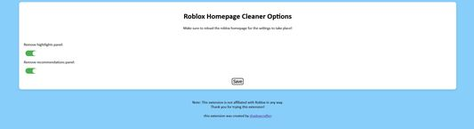

# Roblox Homepage Cleaner

This extension allows you to hide parts of the [Roblox homepage](https://www.roblox.com/home) to make it look cleaner.

Currently, this extension <b>only works with Firefox.</b>

## Installation

To install the extension, it can be installed from the Firefox browser addons site [here](https://addons.mozilla.org/en-US/firefox/addon/roblox-homepage-cleaner/).

Alternatively, it can be manually installed with Firefox's <i>Install Add-on from File</i> option.

## Usage

Using the extension is fairly straightforward.

Once installed, you can click on the extension to open a popup to modify the settings. This will show you options to turn different parts of the [Roblox homepage](https://www.roblox.com/home) on and off.

After making your selections and saving, <b>upon reloading the [Roblox homepage](https://www.roblox.com/home),</b> you should see your changes!!!

## Contributing

Contributing is welcome! This was mostly created as a side project for fun to learn some web development, but contributions are still welcome.

This project is also licenced under the MIT licence, so feel free to fork it and make it your own! 😊
